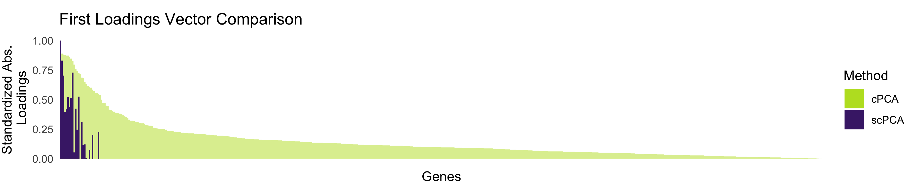

class: middle, center, inverse

# Motivation

```{r load_refs, include=FALSE, cache=FALSE}
library(RefManageR)
BibOptions(
  check.entries = FALSE,
  bib.style = "authoryear",
  cite.style = "authoryear",
  style = "markdown",
  hyperlink = TRUE
)
my_bib <- ReadBib("references.bib", check = FALSE)
```

???

First, we'll briefly motivate our dimensionality reduction method.

---
class: left, top

# Motivation

A common problem in the analysis of high-dimensional biological data is the
teasing out of biological signal from technical noise, i.e. the removal of
*unwanted* variation. 

.center[]

???

As you well know, a common issues that arises in the analysis of high-dimensional biological data is the teasing out of meaningful signal from technical noise.
In this toy example over here, the first two principal components of some data
are presented. There are two distinct biological groups, one green, one purple, and
each group is split by a batch effect, where each observations' batch is denoted
by it's shape.

Before we analyze this data, we'll have to remove this batch effect. Now there
are plenty of options to do this, but many of them make some restrictive assumptions
about how this data has been generated. Instead, we'd like to remove this unwanted
variation without needing to make untenable assumptions. This is where our
scPCA method can be of use.

---
class: middle, center, inverse

# Background

???

Now, scPCA is simply the combination of two different dimensionality reduction
methods: contrastive PCA (or cPCA for short), and sparse PCA (referred to as SPCA).
I'll briefly introduce these two methods before going any further.

---
class: left, top

# cPCA

Given a **target** dataset containing both *wanted* and *unwanted* variation,
and a **background** dataset containing only *unwanted* variation, cPCA produces
a low-dimensional embedding of the target data reflecting (a portion of)
the variation not found in the background data.

.center[


*Figure 1, `r Citet(my_bib, "Abid2018")`*
]

???

cPCA provides its users with a novel approach for the removal of unwanted variation
by taking advantage of experimental design which generated the data. That is,
given a dataset which contains a wanted and unwanted variation, which we refer
to as the target, and a dataset containing only the unwanted variation, referred
to as the background data, we can deflate the unwanted variation in the target
data.

A sketch of how this is accomplished is nicely summarized in the first figure
of Abid and others, the developers of this method. First, the sample covariance
matrices of the target and background data are computed. Next, we take the
difference of the target's and background's sample covariance matrices, scaling
the background's matrix by a hyperparameter, known as the contrastive parameter.
We then get the eigendecomposition of the resulting symmetric matrix, the
contrastive matrix, and use the decomposition's loadings vectors to rotate the
target data. By appropriately tuning the contrastive parameter, we're effectively
able to remove the noise in the target.

In this example over here, we see that the first principal component corresponds
the red, dotted line. This axis of variation isn't all that interesting; it
won't separate the groups contained in the target data. However, the leading
cPCA will be able to deflate this un-interesting variation.

---
class: left, top

# Drawbacks

1. Like PCA in high dimensions, interpreting cPCA's loadings is difficult.
2. The contrastive parameter, $\alpha$, is selected visually.

.center[


*[xkcd.com/1838/](https://xkcd.com/1838/)*
]

???

Although, this is an interesting approach to the removal of unwanted variation,
there are a few issues. Namely, since this method is essentially PCA but applied
to a different covariance matrix, it suffers from the same issues as PCA does in
high dimensions. In particular, interpreting cPCA's loadings vectors, the vectors
that define the linear combinations of each contrastive principal component, is
quite difficult, and they are potentially unstable. Even worse, selecting the
appropriate contrastive parameter is accomplished through visual inspection. All
analyses are subjective to some degree, but this takes that to another level.

---
class: left, top

# SPCA

SPCA `r Citep(my_bib, "Zou2006")` provides interpretable loadings that are more
stable in high dimensions. How is this accomplished?

--

1. Re-frame PCA as a regression problem: PCA produces a linear manifold
approximation of the data.
2. Extend elasticnet regression to this regression problem. That is, include
$\ell_1$ and $\ell_2$ penalty terms to induce sparsity in loadings vectors.

--

This second step isn't as straightforward as in the typical regression setting,
but it is possible to do it efficiently `r Citep(my_bib, "Erichson_2020")`.

???

Based on these drawbacks, you probably see where I'm going with SPCA. For those
of you who aren't familiar with SPCA, it's a method originally developed by
Zou et al that increases the interpretability and stability of PCA in high
dimensional settings. 

This is accomplished by first re-framing PCA as a linear regression problem, and
then including L1 and L2 penalties in the objective function to induce sparsity
in the loadings vectors. This is analogous to an elasticnet regression. And
just like in classic elasticnet, lasso, and ridge regressions, the penalty
hyperparamters have to be selected somehow.

Now, this process isn't exactly as easy as I've let on, but there are some
very efficient numerical methods to solve this problem. One that we employ in our
package is that of Erichson and others.

---
class: middle, center, inverse

# Sparse Contrastive Principal Component Analysis (scPCA)

???

With the background done, we can finally talk about scPCA.

---
class: left, top

# scPCA

scPCA consists of applying SPCA on the contrastive covariance matrix of
target and background datasets. We get the best of both of cPCA and SPCA:

* Unwanted variation is removed from the target dataset
* scPCA's loadings are interpretable
* scPCA's loadings are stable

--

But what about the hyperparameters?

???

As I mentioned before, scPCA is essentially a combination of the cPCA and SPCA,
requiring only a few minor modifications required to make these methods well
together.

The result is a method sparse version of cPCA. That is, scPCA's are now
interpretable and stable in the high-dimensional settings that we so often
encounter when analyzing the data output by high-throughput assays.

However, we're note completely done. We still need to come up with a way to
select scPCA's hyperparameters: the contrastive parameters, and an L1 penalty
term that controls the levels of sparsity.

---
class: left, top

# Hyperparameter Tuning

There are two main hyperparameters in the scPCA algorithm:
+ The constrastive parameter $\alpha$
+ The $\ell_1$-penalty parameter $\lambda_1$ 

Hyperparameters are selected via a clustering-based grid-search method:

1. A grid of hyperparameters is specified
2. scPCA is performed for each pair of hyperparameters
3. A clustering algorithm is applied to the resulting low-dimensional embedding
4. Each embedding's quality is evaluated via the average silhouette width

The pair of hyperparameters that results in the largest average silhouette width
are identified as *optimal*.

A cross-validated variation also exists if finding non-generalizable patterns
in the data is a concern.

???

This attempts to solve one of the main issues with cPCA and SPCA, and can in
fact be generalized to both. However, it assumes that there are clusters in
the high-dimensional space.

---
class: left, top

# Implementation

The `scPCA` R package, released in Bioconductor 3.10, implements:
1. scPCA
2. cPCA with automated hyperparameter tuning
3. cross-validated scPCA and cPCA
4. cPCA with visual hyperparameter tuning

--

### Relevant details:

+ The hyperparameter tuning framework is embarrassingly parallel. Methods 1, 2, and 3 posses parallelized counterparts, making use of the `BiocParallel` infrastructure.
+ The `scPCA` package integrates fully with the `SingleCellExperiment` container class, allowing for these methods' seamless inclusion in scRNA-seq analysis pipelines. 
+ The scPCA method is applied to a contrastive covariance matrix; its running time is impacted by the number of features, not observations.

---
class: middle, center, inverse

# Example

---
class: left, top

# Simulated scRNA-seq Data

300 cells and 500 genes were simulated using the `Splat` framework of
`r Citet(my_bib, "Zappia2017")`, and split into 3 equally sized groups.

.center[]

A number of leading dimensionality reduction methods were applied to the target
data to determine if they could disentangle the biological signal from the
batch effect.

???
Two groups had high levels of DE when compared to all others, making up the
target dataset, and the remaining group, which has low-levels of DE, makes up
the background data. A batch effect was included to mask the biological groups
in the target data.

---
class: left, top

# Simulated scRNA-seq Data (Cont.)

.center[]

---
class: left, top

# Simulated scRNA-seq Data (Cont.)

.center2[]

---
class: inverse, center, middle

# Fin.

See our paper, Exploring High-Dimensional Biological Data with Sparse
Contrastive Principal Component Analysis, for more information.

---
class: left, top

# References

```{r refs_1, echo = FALSE, results='asis'}
PrintBibliography(my_bib)
```
